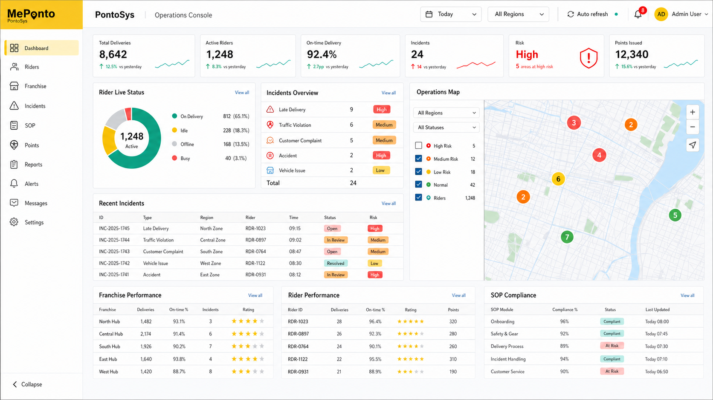
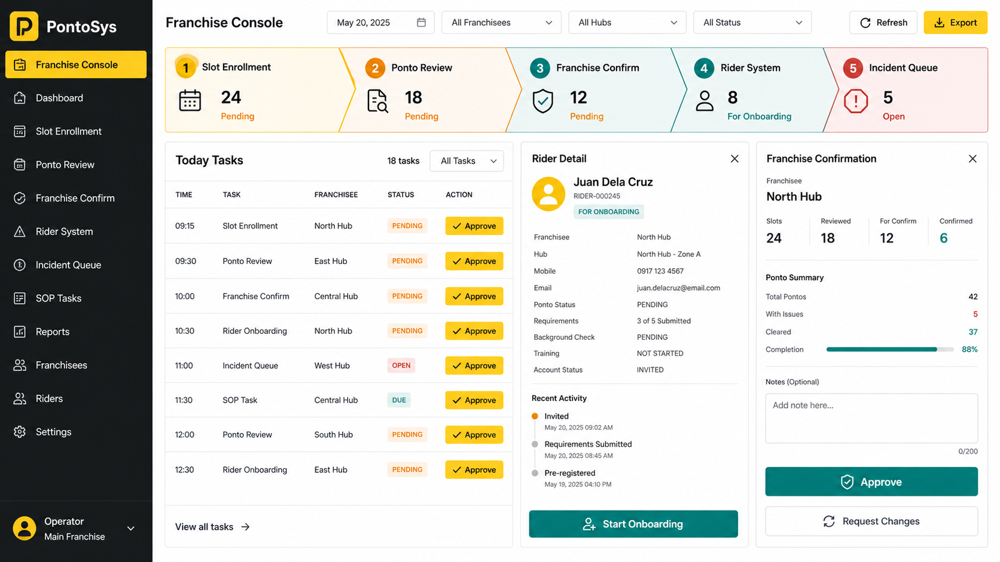
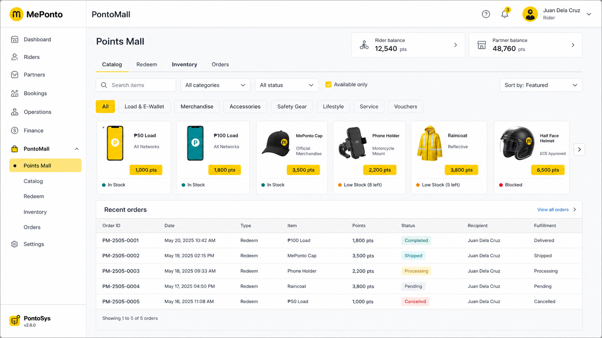
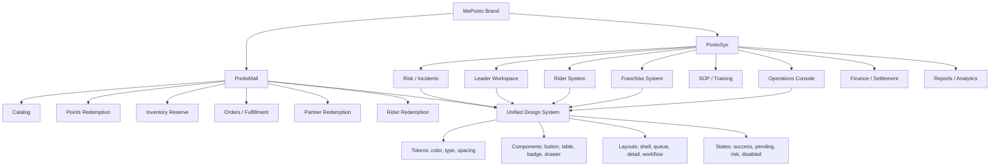

# MePonto Design Language

## Product Naming

- **MePonto** is the brand.
- **PontoSys** is the operations system: control console, franchise workflows, rider system, Leader workspace, SOP, risk, finance, analytics, and admin tools.
- **PontoMall** is the mall system: catalog, points redemption, inventory reserve, orders, and fulfillment.

## UI Principle

The interface is an operating system, not a marketing site. Every module should help users scan, decide, and act quickly.

1. Keep screens dense but calm.
2. Support light and dark modes with high text contrast in both.
3. Prefer tables, queues, status chips, drawers, and compact workflow panels.
4. Avoid hero sections, decorative backgrounds, gradient cards, nested cards, and oversized copy.
5. Every function must remain reachable; simplification means fewer steps, not fewer capabilities.

## Theme Tokens

PontoSys and PontoMall use one semantic token set with two palettes. Components must reference tokens, not raw hex colors, so every workflow remains readable when the user switches between light and dark.

| Token | Use |
| --- | --- |
| `--background` | App canvas |
| `--surface` | Sidebar and header |
| `--surface-raised` | Inputs, table headers, field blocks |
| `--surface-hover` | Row and navigation hover |
| `--line` | Borders and separators |
| `--text` | Primary text |
| `--text-soft` | Table cells and secondary readable text |
| `--muted` | Eyebrows and labels |
| `--accent` | MePonto yellow primary action/accent |
| `--ok` | Success/available |
| `--warning` | Pending/medium risk |
| `--danger` | Critical/risk/open incident |

Required behavior:

- Default mode is dark.
- The shell exposes a light/dark toggle in the top control bar.
- The selected theme is persisted locally.
- Inputs, tables, drawers, badges, side panels, and hover states must use semantic tokens.
- Text must pass visual contrast in both modes; never place muted text on a low-contrast surface.

## Layout Standard

```txt
Left navigation -> grouped by system area
Top bar -> region, notifications, language, role, logout
Page title -> short product/module title + operational eyebrow
Summary row -> 3 to 5 compact metrics
Main workspace -> table, queue, workflow, map, or catalog
Right action panel -> selected record, next action, form, or operational summary
Drawer -> create/edit workflows that need more fields
```

## Direction Mockups







## Component Rules

- Radius is `8px` or less.
- Buttons use icons when the action is common or tool-like.
- Primary actions use MePonto yellow.
- Destructive/risk actions use red only.
- Status must use `Badge`.
- Repeated records must use `DataTable` or a compact queue list.
- Avoid cards inside cards.
- Text must not rely on low contrast, blur, glow, or gradients.
- Long tables may scroll horizontally, but row height should stay compact.

## Module Logic Diagram



## Page Simplification Checklist

- Can the user complete the primary action in one visible work area?
- Are filters grouped into one compact toolbar?
- Are metrics limited to the few numbers needed for that workflow?
- Is detail shown in a drawer or side panel instead of sending the user away?
- Are table actions clear and short?
- Are empty, loading, disabled, success, pending, and risk states visible?
- Does the page still work on mobile without text overlap?
