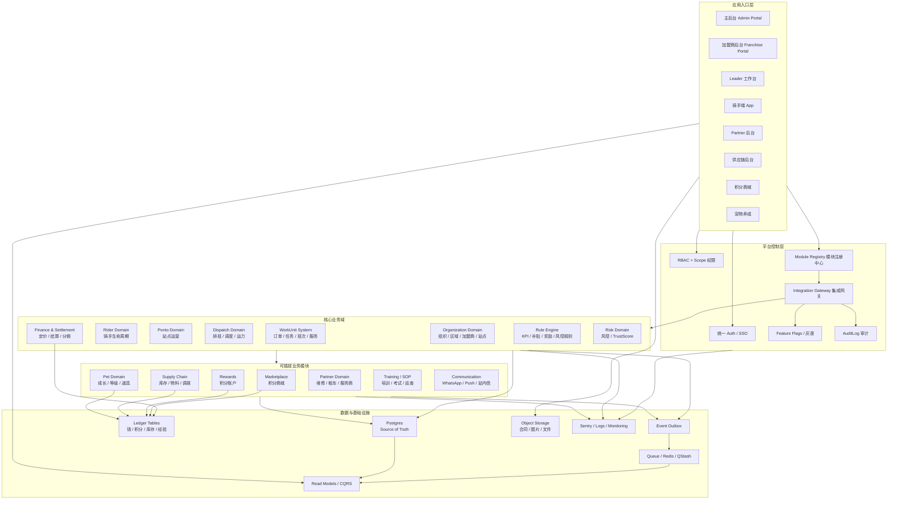
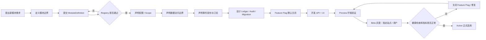
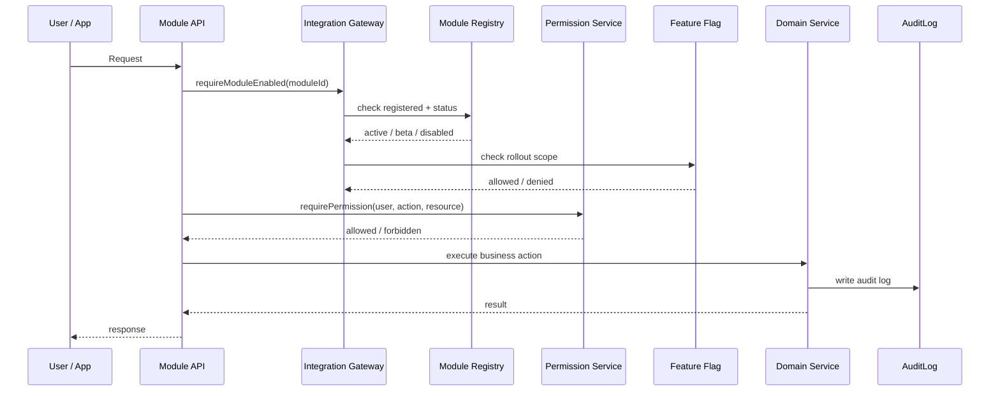
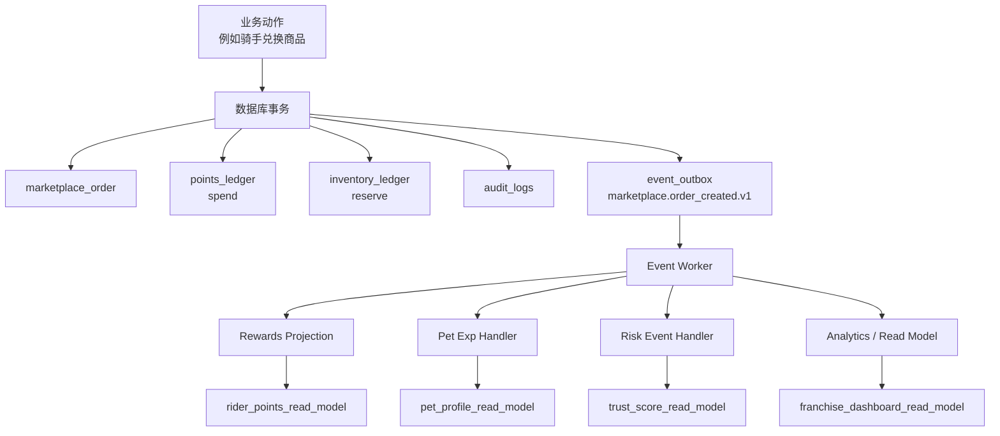
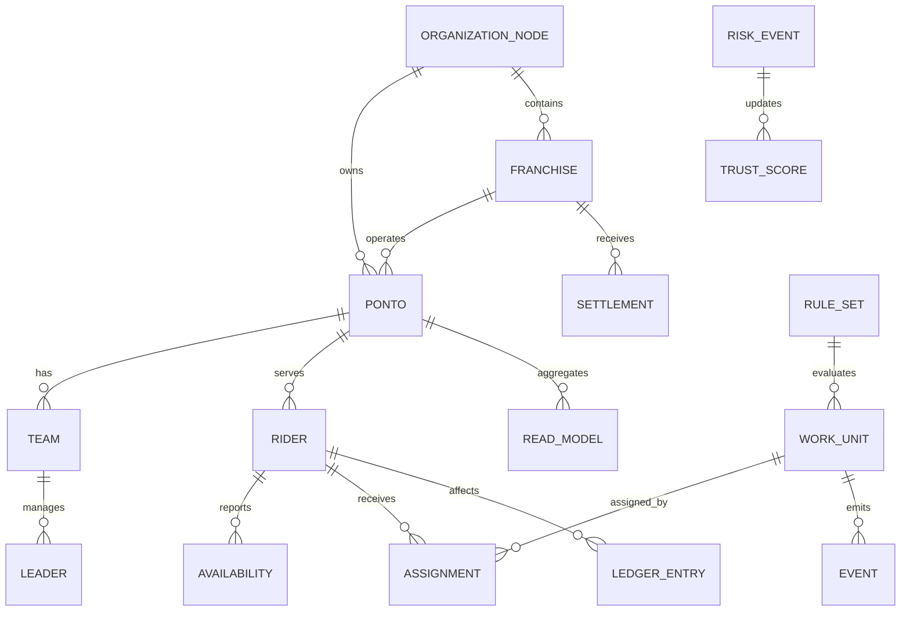
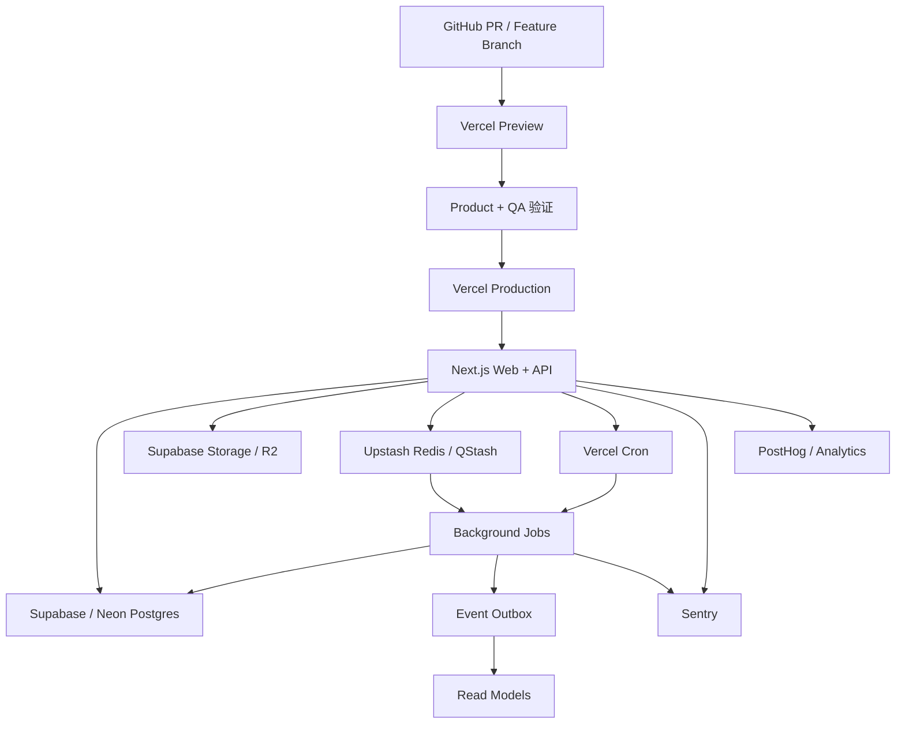

# MePonto Ecosystem OS v2 图示

## 1. 总体架构图



## 2. 新模块接入流程图



## 3. 模块网关控制逻辑



## 4. 事件与数据流图



## 5. 核心业务抽象图



## 6. 部署与低运维架构图



## 7. 一句话版

```txt
所有应用统一入口，所有模块先注册再接入，
所有跨模块动作走事件，所有钱/积分/库存走流水，
所有新功能先灰度，所有关键操作可审计。
```
