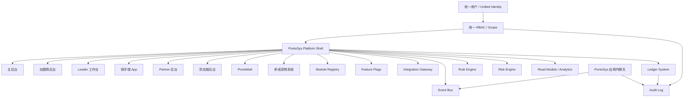
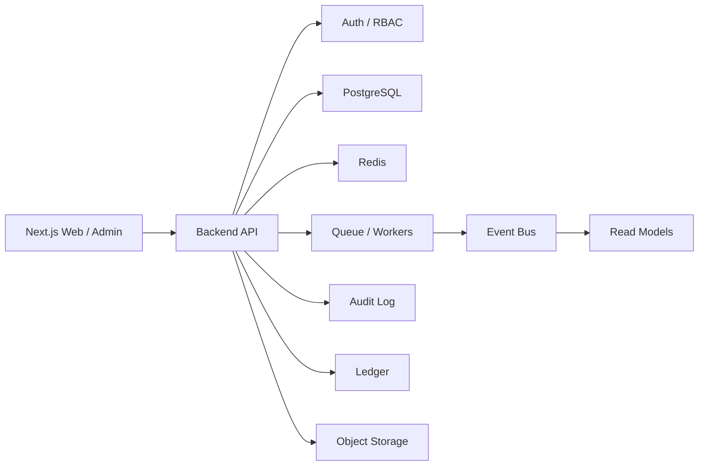
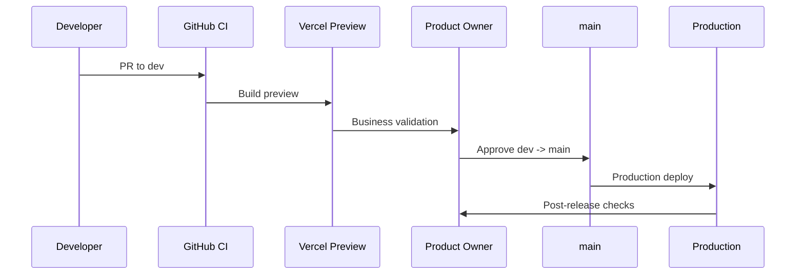

# MePonto 产品策划书与开发部门执行手册 v1.0

本文档是 MePonto / PontoSys 当前阶段给开发部门使用的完整产品策划与执行手册。它汇总已经确认的产品方向、系统架构、模块范围、团队分工、开发规则、测试环境、上线流程和验收标准。

本手册不是单一功能说明，而是开发部门的工作入口。所有开发人员、Codex 代理和外部协作人员在开发新模块、修改现有模块、提交 PR、部署测试环境或准备上线前，都必须先阅读并遵守本文档。

## 1. 最终方案确认

### 1.1 品牌与系统名称

| 项目 | 标准名称 |
| --- | --- |
| 品牌名 | MePonto |
| 主系统名 | PontoSys |
| 巴西本地运营品牌 | MePonto |
| 骑手端体验名称 | MePonto |

要求：

- 用户可见位置必须使用 MePonto 和 PontoSys。
- 不允许继续使用旧品牌、临时名称或不一致大小写。
- 除非有明确产品决策，不允许重命名 MePonto 或 PontoSys。

### 1.2 产品定位

MePonto 不是一个简单后台，也不是多个页面拼接的工具。

MePonto 的产品定位是：

```txt
面向巴西骑手服务网络的 Ecosystem OS。
```

PontoSys 是 MePonto 的运营系统底座，用于支撑：

- 主后台
- 加盟商后台
- Leader 工作台
- 骑手端 App
- SOP 与培训中心
- Partner 系统
- 供应链系统
- PontoMall 商城系统
- PontoMall 后台
- 养成宠物系统
- 调度系统
- 风控系统
- 规则引擎
- 数据分析与报表系统

系统设计必须从第一天按平台级生态系统建设，而不是按一次性页面开发。

### 1.3 当前已确认的重要产品决策

| 决策 | 结论 |
| --- | --- |
| 通信能力 | 移除外部聊天接入，统一替换为 PontoSys 原生应用内聊天 |
| 登录体系 | 禁止子系统单独登录，统一身份体系 |
| 模块接入 | 新模块必须通过 Module Registry 设计注册 |
| 灰度发布 | 新能力必须默认 disabled 或 beta |
| 语言支持 | 必须支持中文、英文、葡语 |
| 巴西面向用户语言 | 葡语优先 |
| 内部业务评审语言 | 中文优先 |
| 钱、积分、库存、奖励、结算 | 必须使用 ledger-style 记录 |
| 团队协作 | 你控制主后台、代码并入、功能定义和部署；开发人员做模块开发、测试和分支提交 |
| 测试环境 | 所有人必须有独立沙盒，测试通过后再合并 |

## 2. 当前系统更新汇总

### 2.1 已完成的系统基础

当前项目已经具备以下基础：

- Next.js 主应用。
- 主后台基础页面。
- 骑手、Ponto、Leader、事故、奖励、财务、CRM、加盟、移动端、实时、SOP、工具、审计、权限、安全、设置等模块。
- API route handlers under `app/api/*`。
- 共享 demo data under `app/lib/*`。
- 服务器侧 process-local memory store。
- 浏览器侧 Zustand demo store。
- RBAC demo permission matrix。
- 敏感字段 CPF / PIX mask 与 reveal API。
- server audit in-memory entries。
- smoke、workflow smoke、a11y smoke、module guard、Codex preflight。
- GitHub CI、PR template、CODEOWNERS。

### 2.2 应用内聊天替换

已确认并完成：

- 移除旧外部聊天入口。
- 删除旧 `/whatsapp` 页面和 API。
- 新增 `/chat` 页面。
- 新增 `/api/chat` 房间 API。
- 新增 `/api/chat/messages` 消息 API。
- 新增 `app/lib/chat.ts` 原生聊天数据模型。
- `app/lib/integrations.ts` 不再包含聊天 provider。
- 文档中明确应用内聊天是 PontoSys 原生模块，不是外部集成 provider。
- 语言支持已覆盖中文、英文、葡语。

应用内聊天后续必须具备：

- chat rooms
- chat messages
- chat memberships
- chat moderation
- read receipts
- audit trail
- retention policy
- room message 和 personal message 区分
- 与 Rider / Ponto / Incident / Leader 关联

禁止将应用内聊天重新实现为任何第三方聊天平台的必要依赖。

### 2.3 加盟商与首店方案

已确认的首店合作方向：

- 首店用于试运营。
- 加盟商负责本地站点执行、骑手招募承接、现场管理和日常反馈。
- MePonto 负责运营模型、PontoSys 系统、数据支持、定价政策、SOP 标准、总部培训和关键问题决策。
- 出现意见分歧时，以 MePonto 的运营思路和标准 SOP 为最终执行口径。

首店关键条件：

| 项目 | 要求 |
| --- | --- |
| 固定门店 | 必须有 |
| 面积 | 至少 30 平米 |
| 人员 | 至少 2 名站点人员 |
| 骑手 | 至少 20 名骑手启动 |
| 基础服务 | 休息、充电、培训、工具、饮水、基础咨询 |
| 定价 | Quality 基准 12 |
| KPI 浮动 | 80%-120% |
| 房租支持 | 前三个月 MePonto 承担 50% |
| 保护期 | 三个月 |
| 结算 | 周结，以合同为准 |

### 2.4 SOP 体系

当前 SOP 体系包括：

- 全职骑手 SOP
- 招聘骑手 SOP
- 站点运营 SOP
- PontoSys 操作手册
- 加盟商合作方案

SOP 必须落地为执行动作，不能停留在原则描述。

总部巡查时应围绕以下动作检查：

- 是否按时签到。
- 是否完成班前检查。
- 是否按 slot 执行。
- 是否按 hotzone 和高峰规则执行。
- 是否记录异常。
- 是否完成收工复盘。
- 是否处理未闭环事故、投诉和支付争议。
- 是否完成招聘转化记录。
- 是否完成培训和 7 日留存跟进。

## 3. 产品总体架构

### 3.1 总体架构图



### 3.2 核心系统原则

1. 统一身份体系。
2. 统一权限模型。
3. 模块边界清晰。
4. 数据边界清晰。
5. 跨模块通信必须通过 API、事件、read model 或 Integration Gateway。
6. 新能力默认不可直接全量开启。
7. 经济系统必须 ledger 化。
8. 事件必须版本化。
9. 语言支持属于验收标准。
10. 主后台必须始终保持可部署。

## 4. 核心模块规划

### 4.1 主后台

负责人：你。

主后台负责：

- 产品定义。
- 模块启用。
- 功能验收。
- 代码并入。
- 权限治理。
- 数据口径。
- 部署发布。
- 回滚决策。
- 加盟商政策。
- SOP 总控。

主后台不是普通 admin 页面，而是整个 PontoSys 的控制中心。

### 4.2 加盟商后台

核心目标：

- 让加盟商可执行站点运营。
- 让总部可巡查加盟商。
- 让数据支持价格、KPI、招聘和运力决策。

一期能力：

- 加盟商 dashboard。
- 站点骑手规模。
- KPI 进度。
- 招聘漏斗。
- hotzone 同步。
- 云骑手单均参考。
- 异常队列。
- 周结对账。
- SOP 执行记录。

不得允许加盟商自行解释未经总部确认的数据口径。

### 4.3 Leader 工作台

核心目标：

- 管理骑手日常状态。
- 跟进异常。
- 执行高峰、夜班、安全和 slot 纪律。

一期能力：

- 骑手 roster。
- 在线状态。
- slot 跟进。
- 应用内聊天房间。
- 事故上报。
- 夜班安全 pulse。
- 低 AR / 低 OPH 跟进。

### 4.4 骑手端 App

核心目标：

- 给骑手提供 MePonto 会员体验。
- 支持 check-in、积分、任务、安全、通知和应用内聊天。
- 不创建单独登录体系。

一期能力：

- 钱包或收入感知入口。
- 积分入口。
- Ponto 信息。
- Leader 支持。
- 安全状态。
- 事故入口。
- 推送和应用内消息。
- Partner 地图入口。

### 4.5 Partner 系统

核心目标：

- 管理骑手后市场服务。
- 支持维修、租车、工具、宿舍、电话卡、加油卡等服务。
- 支持积分奖励和服务核验。

原则：

- 骑手不使用积分直接支付 Partner。
- 骑手向 Partner 现金 / PIX / card 支付。
- Partner 因完成核验服务获得 MePonto points。
- Partner points 后续可在 PontoMall 兑换。

### 4.6 供应链系统

核心目标：

- 管理工具、装备、库存、供应商和站点补给。
- 与 PontoMall、Partner 服务和站点库存联动。

必须使用库存 ledger 或库存流水，不允许直接覆盖库存余额。

### 4.7 PontoMall 商城系统

核心目标：

- 让骑手和 Partner 使用 MePonto points 兑换已批准商品、服务或权益。
- 积分必须 append-only ledger。

必须支持：

- points account
- points ledger
- earn rules
- redeem rules
- refund / compensation
- expiry
- fraud review
- read model

### 4.8 养成宠物系统

核心目标：

- 作为骑手成长、留存和任务体系的一部分。
- 与积分、任务、出勤、安全和服务质量挂钩。

原则：

- 宠物经验、等级、道具、奖励必须可追溯。
- 涉及经济价值时必须 ledger 化。
- 不允许直接修改经验余额而没有记录。

### 4.9 调度系统

后续必须形成独立 Dispatch Domain。

范围：

- slot
- availability
- capacity
- heatmap
- hotzone
- assignment
- shift planning
- rebalancing

调度不能散落在 rider、slot、task 页面里。

### 4.10 风控系统

必须逐步建设 Risk Domain。

重点风险：

- 假骑手。
- 假 GPS。
- 多账号。
- 套补贴。
- 假库存。
- 假兑换。
- Leader 与骑手串通。
- Partner 套现。
- PIX fraud。

需要：

- risk events
- risk rules
- risk actions
- trust score
- device / behavior signals
- audit

## 5. 数据与技术架构

### 5.1 当前架构状态

当前系统是 MVP 架构：

- Next.js app。
- API routes under `app/api/*`。
- process-local memory。
- demo seed data。
- Zustand browser persistence。
- typed repository facade。

这适合 MVP 和演示，但不适合长期生产。

### 5.2 目标生产架构

目标演进方向：



建议生产演进：

1. 保持 Next.js 作为 Web 和管理后台。
2. 后端逐步迁移到 NestJS 或等价模块化 API 服务。
3. PostgreSQL 作为 source of truth。
4. Redis 用于缓存、队列、rate limit、临时状态。
5. Workers 处理聊天 fanout、通知、导入、结算、报表投影。
6. Audit 和 Ledger 必须持久化。

### 5.3 数据边界

每个模块必须定义：

- 自己拥有的数据。
- 可以读取的外部数据。
- 可以暴露给其他模块的数据。
- 保留策略。
- LGPD 敏感等级。

禁止：

- 直接写别的模块私有数据。
- 绕过 API 修改共享状态。
- 用 dashboard 字段作为 source of truth。
- 删除 ledger / audit 历史。

## 6. 语言与本地化要求

### 6.1 必须支持的语言

| 语言 | 代码 | 使用场景 |
| --- | --- | --- |
| 中文 | zh | 内部业务评审、总部政策、开发沟通 |
| 英文 | en | 技术标签、跨团队交付、默认系统结构 |
| 葡语 | pt | 巴西骑手、站点、Leader、加盟商、培训、SOP |

### 6.2 必须覆盖的内容

新增或修改以下内容时必须检查三语：

- 导航。
- 页面标题。
- 表单 label。
- placeholder。
- button。
- filter。
- tab。
- table header。
- status label。
- empty state。
- loading state。
- error state。
- success message。
- user-facing API error。
- SOP。
- 培训内容。
- PDF / HTML 导出。
- 通知模板。
- 应用内聊天模板。

### 6.3 禁止事项

- 不允许同一用户可见标签里随意混用中文、英文、葡语。
- 不允许遗留旧品牌名称。
- 不允许只改英文页面，不补葡语。
- 不允许 Brazil-facing 内容没有葡语。

如某次任务临时只做单语言，PR 必须说明原因和补齐计划。

## 7. 团队分工与权限

### 7.1 推荐分工

| 人员 | 责任 | 权限 |
| --- | --- | --- |
| 你 | 主后台、产品定义、代码并入、功能更新、部署、回滚、最终业务判断 | 最终合并权和生产发布权 |
| 开发者 A | 加盟商、财务、合作方案、站点运营模块 | 提交模块分支和 PR |
| 开发者 B | 骑手、Leader、移动端、骑手生命周期 | 提交模块分支和 PR |
| 开发者 C | PontoMall、积分、供应链、宠物养成、Partner 模块 | 提交模块分支和 PR |
| Codex | 代码实现、文档生成、测试、检查、PR 说明 | 只能按开发者指令提交，不自动合并 |

### 7.2 你必须控制的事项

以下事项必须由你确认：

- 产品方向。
- 模块是否进入开发。
- 模块是否进入 beta。
- 模块是否 active。
- 共享数据模型。
- Module Registry。
- Feature Flag 策略。
- 权限模型。
- 结算、积分、价格、KPI。
- 加盟商政策。
- 生产部署。
- 回滚。

## 8. 开发流程

### 8.1 标准流程图

```mermaid
flowchart LR
  A["需求确认"] --> B["模块合同"]
  B --> C["创建沙盒"]
  C --> D["codex/<module>-<task> 分支"]
  D --> E["开发实现"]
  E --> F["本地 preflight"]
  F --> G["提交 PR 到 dev"]
  G --> H["GitHub CI"]
  H --> I["Vercel Preview"]
  I --> J["业务验收"]
  J --> K["合并 dev"]
  K --> L["集成回归"]
  L --> M["dev -> main"]
  M --> N["生产发布"]
```



### 8.2 分支策略

| 分支 | 作用 |
| --- | --- |
| `main` | 生产可部署分支 |
| `dev` | 日常集成与测试分支 |
| `codex/<module>-<task>` | 单任务开发分支 |
| `hotfix/<issue>` | 紧急修复分支 |

合并顺序：

```txt
codex/* -> dev -> main
```

禁止：

- 直接推送 `main`。
- 绕过 PR 合并。
- 在一个模块分支里混入多个不相关模块。
- 用 force push 覆盖别人工作。

### 8.3 沙盒环境

每个开发人员必须有独立沙盒。

推荐方式：

```bash
git worktree add -b codex/franchise-settlement ../sandbox-franchise dev
git worktree add -b codex/rider-onboarding ../sandbox-rider dev
git worktree add -b codex/marketplace-catalog ../sandbox-marketplace dev
```

每个沙盒使用不同端口：

```bash
npm run dev -- -p 3001
npm run dev -- -p 3002
npm run dev -- -p 3003
```

沙盒要求：

- 不使用生产数据库。
- 不使用生产支付配置。
- 不使用真实个人敏感数据。
- 每个开发者独立 `.env.local`。
- Preview 环境变量和 Production 环境变量分开。

## 9. 模块开发标准

### 9.1 模块开工前必须完成

新增模块前必须同时具备模块产品策划书和模块合同。产品策划书说明“开发具体做什么、页面和流程如何验收”，模块合同说明“模块如何接入 PontoSys 总系统、数据边界和权限边界是什么”。

产品策划书模板：

```txt
docs/module-product-spec-template.md
```

模块合同模板：

```txt
docs/module-contract-template.md
```

产品策划书必须包含：

```txt
产品背景
用户角色
产品目标
本期不做
功能范围
页面与交互
数据需求
API 与事件
业务规则
权限与风控
语言与内容
验收标准
上线与回滚
后续迭代
```

模块合同必须包含：

```txt
Module name:
Owner:
Status:
Route:
Feature flag:
Business purpose:
Allowed roles:
Required scopes:
Private data:
APIs:
Events:
Ledger impact:
Rule engine impact:
Read models:
Localization:
Rollout plan:
Rollback plan:
```

### 9.2 新模块必须满足

- 有产品策划书。
- 有模块合同。
- 有明确 owner。
- 有明确 route。
- 有 feature flag。
- 默认 disabled 或 beta。
- 有权限说明。
- 有数据边界。
- 有 API contract。
- 有事件版本。
- 有三语文案。
- 有测试方式。
- 有回滚方式。

### 9.3 模块状态

| 状态 | 含义 |
| --- | --- |
| disabled | 代码存在，但不可见或不可用 |
| beta | 内部或指定范围可用 |
| active | 正式启用 |
| deprecated | 保留兼容，不再新增能力 |

## 10. 测试与验收

### 10.1 本地检查

普通模块：

```bash
npm run codex:preflight
```

高风险或发布前：

```bash
npm run codex:preflight:full
```

当前完整检查包括：

- module guard
- production build
- smoke
- accessibility smoke
- workflow smoke

### 10.2 GitHub CI

当前 `.github/workflows/codex-ci.yml` 会执行：

```bash
npm ci
npm run module:guard
npm run build
npm run check
```

CI 必须通过后才能合并。

### 10.3 人工验收

Codex 和 CI 不能替代以下人工确认：

- 业务规则是否正确。
- 加盟商政策是否符合合同。
- 财务公式是否符合商业口径。
- 葡语表达是否适合巴西本地。
- 页面是否符合品牌感。
- 生产发布时间是否合适。

## 11. PR 与代码并入

### 11.1 PR 必填内容

PR 必须包含：

- Summary。
- Module。
- What Changed。
- Shared Code Touched。
- Verification。
- 三语检查。
- Feature Flag。
- 权限检查。
- Ledger 检查。
- Brand 检查。

### 11.2 合并条件

进入 `dev` 前：

- 本地 preflight 通过。
- GitHub CI 通过。
- Preview 可访问。
- 模块 owner 自查通过。
- 无明显跨模块越界。

进入 `main` 前：

- `dev` 集成回归通过。
- `npm run codex:preflight:full` 通过。
- 关键页面人工验收通过。
- 回滚方案明确。
- 由你批准。

## 12. 上线与回滚

### 12.1 发布节奏

建议：

- 每周 1-2 次常规发布。
- 高风险模块集中在固定发布窗口。
- hotfix 单独走紧急流程。

### 12.2 发布流程



### 12.3 回滚原则

优先级：

1. 关闭 Feature Flag。
2. 回滚 Vercel 部署。
3. revert PR。
4. 数据补偿或 ledger compensation。

禁止：

- 直接删除生产数据。
- 手工改钱、积分、库存余额。
- 不记录 audit 的紧急修改。

## 13. Codex 使用规范

### 13.1 每次任务启动指令

建议统一使用：

```txt
请先读取 AGENTS.md，并严格遵守 docs/module-development-playbook.md、docs/module-contract-template.md、docs/pr-checklist.md。
本次只开发 <模块名> 模块。
不要修改 auth、RBAC、ledger、Module Registry、Integration Gateway 或共享 API，除非你先说明原因并获得确认。
完成后运行 npm run codex:preflight。
```

### 13.2 Codex 可以直接做

- 创建模块页面。
- 新增 API route。
- 补 i18n。
- 生成模块合同。
- 生成 SOP。
- 写 smoke test。
- 跑 build / preflight。
- 检查残留品牌名。
- 检查跨模块违规。
- 生成 PR 描述。

### 13.3 Codex 必须先确认

- 权限模型。
- 钱、积分、库存、结算。
- 数据库 schema。
- 生产部署。
- 破坏性迁移。
- 业务政策。
- 合同条款。
- 加盟商价格。
- 应用内聊天权限、审核、留存和审计规则。

### 13.4 Codex 提交规则

Codex 只有在开发者明确要求时才能：

- stage
- commit
- push
- create PR

提交前必须：

```bash
npm run codex:preflight
```

高风险或发布前必须：

```bash
npm run codex:preflight:full
```

## 14. 开发部门执行清单

### 14.1 每日开发清单

- [ ] 从 `dev` 拉最新代码。
- [ ] 确认当前任务属于哪个模块。
- [ ] 确认模块合同是否存在。
- [ ] 创建 `codex/<module>-<task>` 分支。
- [ ] 启动独立端口沙盒。
- [ ] 开发前给 Codex 明确边界。
- [ ] 开发后检查三语。
- [ ] 运行 `npm run codex:preflight`。
- [ ] 提交 PR 到 `dev`。

### 14.2 模块验收清单

- [ ] 模块边界清楚。
- [ ] 没有直接写其他模块私有数据。
- [ ] 权限已检查。
- [ ] Feature Flag 已配置。
- [ ] 事件已版本化。
- [ ] Ledger 影响已判断。
- [ ] 中文完整。
- [ ] 英文完整。
- [ ] 葡语完整。
- [ ] 空状态、错误状态、按钮、表头已本地化。
- [ ] API smoke 已覆盖。
- [ ] Preview 已验证。
- [ ] 回滚方式明确。

### 14.3 发布验收清单

- [ ] `dev` 当前版本已冻结。
- [ ] 所有 PR CI 通过。
- [ ] `npm run codex:preflight:full` 通过。
- [ ] 关键页面浏览器验证通过。
- [ ] 数据库迁移已确认。
- [ ] Feature Flag 可关闭。
- [ ] 回滚方案已确认。
- [ ] 你批准发布。

## 15. 接下来 30 天执行计划

### 第 1 周：协作制度落地

目标：

- `dev` 分支作为集成分支。
- 每个开发者建立独立沙盒。
- Vercel Preview 环境可用。
- GitHub CI 作为合并门禁。

任务：

- 确认 GitHub Ruleset。
- 确认 CODEOWNERS 团队成员真实可用。
- 配置 Vercel Preview 环境变量。
- 为三位开发者建立 worktree 或独立 clone。
- 演练一个小模块从分支到 PR 到 Preview。

### 第 2 周：核心运营模块稳定

目标：

- 主后台基础数据口径稳定。
- 加盟商、骑手、Leader、SOP 形成可演示闭环。

任务：

- 完善加盟商 dashboard。
- 完善全职骑手 SOP。
- 完善招聘 SOP。
- 完善站点运营 SOP。
- 完善应用内聊天 room / message 使用场景。

### 第 3 周：积分与 Partner 能力

目标：

- 积分经济标准落地到模块合同。
- Partner 服务核验流程明确。

任务：

- 完成 points account / ledger 模型细化。
- 完成 Partner 服务合同。
- 完成 PontoMall 兑换 MVP 规则。
- 明确供应链库存 ledger。

### 第 4 周：生产化准备

目标：

- 从 demo memory 架构向生产后端迁移做准备。

任务：

- 确认 PostgreSQL schema。
- 确认 Redis / queue 需求。
- 确认 audit / ledger 持久化方案。
- 确认 LGPD 合规要求。
- 明确 NestJS 或后端服务拆分节奏。

## 16. 开发部门必须阅读的文档

开发前必须阅读：

```txt
AGENTS.md
docs/meponto-ecosystem-development-standard-v2.md
docs/meponto-ecosystem-os-v2-diagram.md
docs/module-development-playbook.md
docs/module-contract-template.md
docs/pr-checklist.md
docs/codex-team-collaboration-manual.md
```

按模块阅读：

```txt
docs/api.md
docs/architecture.md
docs/schema.sql
docs/franchise-cooperation-plan.md
docs/pontosys-manual.md
docs/meponto-points-economy-standard.md
docs/modules/*.md
```

## 17. 最终执行口径

MePonto / PontoSys 的开发不能以“先做出来”为唯一目标。

正确目标是：

```txt
每一个模块都能被独立开发、独立测试、独立灰度、独立回滚，
同时又能通过统一身份、统一权限、统一数据、统一事件和统一运营规则接入 Ecosystem OS。
```

开发部门必须记住：

- 你控制主后台和最终合并。
- 开发者负责模块开发、模块测试和分支提交。
- 所有人使用独立沙盒。
- 测试通过后进入 PR。
- PR 通过 CI 和 Preview 后进入 `dev`。
- `dev` 回归通过后才进入 `main`。
- 生产发布必须由你批准。

这套机制的目标不是增加流程，而是防止系统在多人并行开发中失控。
