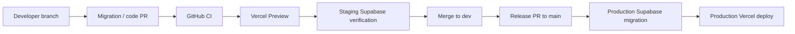

# MePonto Supabase + GitHub + Vercel Setup

This document defines how to connect the MePonto/PontoSys project to Supabase, GitHub, and Vercel without exposing secrets in the repository.

## 1. Current Project Links

| Item | Value |
| --- | --- |
| GitHub repository | `siyutech2024-cmd/meponto` |
| Vercel project | `meponto` |
| Vercel project id | `prj_gG8qOocUuerF0ugY8N4pgum5VhUI` |
| Supabase staging project | `meponto-staging` |
| Supabase staging project ref | `knjzvrquiksdyhzrlpsw` |
| Supabase staging organization | `MePonto` (`hccudebuidnbkocbvogc`) |
| Production branch | `main` |
| Integration branch | `dev` |
| Supabase local config | `supabase/config.toml` |
| Initial database migration | `supabase/migrations/20260603000000_initial_schema.sql` |

## 2. Required Supabase Project

Create or select one Supabase project for MePonto staging first.

Recommended naming:

```txt
meponto-staging
```

Later create a separate production project:

```txt
meponto-production
```

Do not use the same Supabase project for Preview, staging, and production data.

## 3. GitHub Connection

In Supabase Dashboard:

```txt
Project -> Settings -> Integrations -> GitHub
```

Select:

```txt
Repository: siyutech2024-cmd/meponto
Branch: main for production migration tracking
Working directory: .
Migrations directory: supabase/migrations
```

Rules:

- Do not allow random branches to apply production migrations automatically.
- Preview branches can run checks, but production migrations must be reviewed.
- Database schema changes must be submitted through PR.
- Migration PRs must pass GitHub CI before merge.

## 4. Vercel Connection

In Vercel:

```txt
Project: meponto
Settings -> Integrations -> Supabase
```

Connect the selected Supabase project to the Vercel project `meponto`.

Environment target:

| Vercel Environment | Supabase Project |
| --- | --- |
| Development | `meponto-staging` |
| Preview | `meponto-staging` |
| Production | `meponto-production` only after final approval |

Do not connect production secrets to Preview before the staging workflow is verified.

## 5. Required Environment Variables

Vercel must have these variables.

Public client variables:

```txt
NEXT_PUBLIC_SUPABASE_URL
NEXT_PUBLIC_SUPABASE_ANON_KEY
```

Server-only variables:

```txt
SUPABASE_SERVICE_ROLE_KEY
DATABASE_URL
DIRECT_URL
```

Optional future variables:

```txt
REDIS_URL
SENTRY_DSN
```

Rules:

- `NEXT_PUBLIC_*` variables are visible in the browser.
- `SUPABASE_SERVICE_ROLE_KEY` must never be exposed to client components.
- `DATABASE_URL` should use pooled connection for runtime.
- `DIRECT_URL` should be used only for migrations/admin jobs.
- Never commit real secrets to `.env`, `.env.local`, or documentation.

## 6. Local Developer Setup

Each developer should create a local file:

```bash
cp .env.example .env.local
```

Then fill values from the staging Supabase project.

Each developer must use their own local sandbox and must not connect local development to production data.

## 7. Database Migration Rules

The current initial schema lives in:

```txt
supabase/migrations/20260603000000_initial_schema.sql
```

Migration rules:

- Every schema change must be a new migration file.
- Never edit an already-applied production migration.
- Money, points, inventory, settlement, audit, and risk tables require owner review.
- Migration PRs must include rollback or compensation notes.
- Migration PRs must pass `npm run codex:preflight:full`.

## 8. Development Flow



## 9. Production Safety

Before linking Supabase production to Vercel Production:

- Confirm `main` is protected.
- Confirm GitHub CI is required.
- Confirm Vercel Production deployment requires owner approval.
- Confirm production Supabase project is separate from staging.
- Confirm service role key exists only in server-side environments.
- Confirm migration owner review is required.
- Confirm rollback plan is written.

## 10. Current Status

Local project preparation:

- GitHub remote is linked.
- Vercel local project is linked.
- Vercel Git integration is connected to `siyutech2024-cmd/meponto`.
- Supabase config has been added.
- Initial Supabase migration has been generated from `docs/schema.sql`.
- `.env.example` has been added.

Manual dashboard actions still required:

- Authorize Supabase GitHub integration.
- Select repository `siyutech2024-cmd/meponto`.
- Connect Supabase integration to Vercel project `meponto`.
- Rotate the temporary Supabase access token used during CLI setup.
