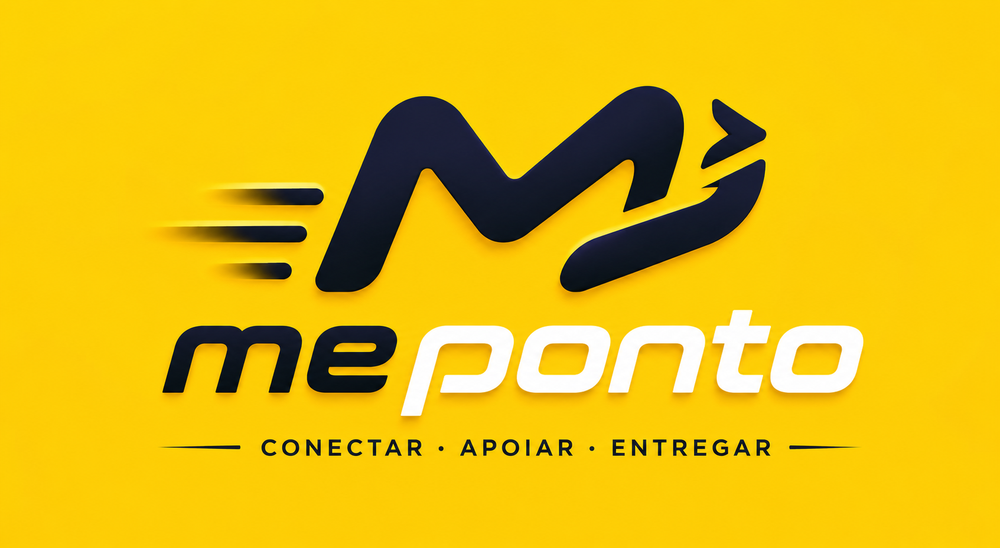
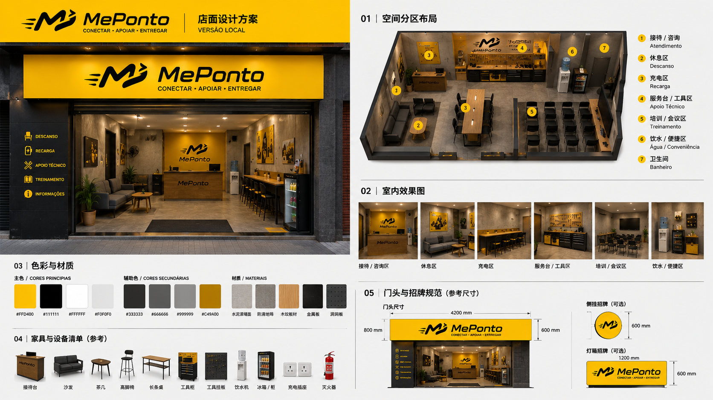

# MePonto 巴西标准加盟商合作方案

## 1. 项目定位

MePonto 在巴西以 **MePonto** 品牌进行运营，围绕骑手服务站点、骑手管理、站点运营、数据支持和本地服务网络建设，发展标准化加盟合作伙伴。

本方案用于对外说明 MePonto 标准加盟模式、准入要求、合作对象、运营责任、支持内容、结算机制和启动流程。具体商业条款、费用、保证金、退出机制和法律责任，以双方最终签署的正式合同为准。

MePonto 的目标不是建立单纯的休息点，而是将具备骑手服务能力的线下门店升级为区域骑手运营节点，承接骑手招募、培训、服务、管理、数据反馈和本地化运营。

## 2. 合作原则

- 统一品牌：对外以 MePonto 品牌进行站点运营和服务呈现。
- 统一系统：使用 PontoSys 或 MePonto 指定系统进行数据、骑手、站点和运营记录管理。
- 统一 SOP：加盟商必须执行 MePonto 制定的骑手 SOP、招聘 SOP、站点运营 SOP 和巡查标准。
- 统一口径：未经 MePonto 确认，加盟商不得对外承诺价格、收入、补贴、平台政策、系统能力或官方身份。
- 以数据决策：运营复盘、KPI、定价调整和站点优化以系统数据、现场记录和 SOP 执行证据为依据。
- 分歧处理：双方出现运营意见分歧时，先复盘数据和现场证据；如仍无法统一，以 MePonto 的运营思路和标准 SOP 为最终执行口径。

## 3. 标准加盟对象

### 3.1 优先合作对象：骑手服务相关门店

优先面向已经服务摩托车、骑手或即时配送人群的线下门店，包括但不限于：

- 摩托车维修店。
- 摩托车租赁店。
- 摩托车 / 电动车销售店。
- 骑手装备、保温包、头盔、雨具等用品门店。
- 已经具备骑手客户群和本地骑手服务经验的综合门店。

此类门店天然具备骑手流量、服务场景和后市场承接能力，是 MePonto 标准加盟的首选对象。

### 3.2 可审核对象：具备骑手运营能力的本地团队

如本地团队具备配送、骑手管理、摩托车服务、租赁、维修、装备销售或骑手社群运营经验，可申请加盟，但必须同时满足以下条件：

- 具备固定门店，或能在签约前落实符合标准的固定站点。
- 团队核心成员具备摩托车、骑手服务或即时配送运营经验。
- 能够承接至少 20 名骑手的启动运营。
- 接受 MePonto 的系统、SOP、KPI 和巡查管理。

### 3.3 暂不接受对象

MePonto 暂不接受仅有普通门店、但没有摩托车业务背景、骑手服务经验或骑手资源基础的申请人作为标准加盟商。

普通便利店、小餐饮、手机店、社区门店等，如没有摩托车 / 骑手服务基础，暂不作为标准加盟商开放。后续可根据 MePonto 网络发展，作为轻量服务点或合作补充点另行评估。

## 4. 基础准入要求

申请标准加盟商需满足以下最低要求：

- 固定门店：必须拥有固定线下门店或可长期使用的固定经营场所。
- 面积要求：可使用面积不少于 30 平方米。
- 人员配置：至少配置 2 名固定运营人员，负责站点日常管理、骑手沟通、数据反馈和异常处理。
- 骑手规模：启动最低要求为 20 名骑手，加盟商需具备招募、承接、培训和管理 20 名以上骑手的能力。
- 基础服务：门店需提供骑手基础服务，包括休息区、饮用水、卫生间、手机充电、基础维修工具或维修协助、骑手沟通和异常上报。
- 运营配合：必须按 MePonto 要求执行 SOP、PontoSys 数据记录、月度 KPI、周度复盘和总部巡查。
- 合规要求：不得擅自使用未经授权的品牌、物料、政策口径或收入承诺。

## 5. 加盟商核心职责

加盟商负责本地站点的日常运营执行，核心职责包括：

1. 骑手招募与承接：根据 MePonto 的招聘策略和站点目标，承接骑手报名、到场、资料核验和入职流程。
2. 骑手培训：组织新骑手完成 MePonto 标准培训，包括 Ponto 纪律、接单规则、slot 规则、安全规则、沟通规则和异常上报。
3. 日常管理：负责骑手签到、开工前检查、在线纪律、区域管理、收工复盘和问题反馈。
4. 站点服务：为骑手提供基础服务，维护站点秩序、设备、环境和服务体验。
5. 数据反馈：按要求使用 PontoSys 或指定工具记录骑手、排班、异常、投诉、事故、付款争议和运营动作。
6. KPI 执行：围绕骑手在线、接单率、OPH、服务质量、投诉、事故和留存等指标开展运营。
7. 异常处理：及时处理和上报事故、投诉、付款争议、骑手离线、拒单、违规和安全事件。

## 6. MePonto 提供支持

MePonto 为标准加盟商提供以下支持：

- 品牌支持：提供 MePonto 品牌规范、基础物料和对外展示标准。
- 系统支持：提供 PontoSys 或指定系统，用于骑手、站点、数据、异常和复盘管理。
- SOP 支持：提供全职骑手 SOP、招聘骑手 SOP、站点运营 SOP 和总部巡查标准。
- 招聘支持：提供总部招聘策略、市场物料、线索导入和转化方法。
- 数据支持：提供 D-1 数据、站点数据、骑手表现、异常队列、hotzone 和运营复盘建议。
- 培训支持：提供站点负责人、运营人员和骑手培训内容。
- 定价与 KPI：提供月度定价机制、KPI 规则和运营评估标准。
- 运营复盘：定期组织站点复盘，帮助加盟商提升骑手稳定性、站点效率和服务质量。

## 7. 品牌与门店形象标准

加盟站点需按照 MePonto 品牌规范进行基础形象建设，确保骑手能够快速识别、信任并愿意进入站点接受服务。品牌和装修方案以 MePonto 最终确认版本为准，加盟商不得自行修改 logo、主色、标语、门头比例或对外物料口径。

### 7.1 Logo 与品牌口号

MePonto 对外品牌建议统一使用黄色、黑色和白色为主视觉。Logo 参考图中包含 MePonto 标识及葡语口号：**CONECTAR · APOIAR · ENTREGAR**，对应品牌定位为连接骑手、支持运营、完成交付。

站点对外展示时，应保持 MePonto logo 清晰、完整，不得拉伸、变形、裁切、换色或与未经授权的第三方标识混用。

### 7.2 门店装修参考

标准加盟站点建议采用轻量但统一的门店形象，重点体现“骑手服务站点”属性，而不是普通门店或单纯休息点。

参考装修方案包含以下功能分区：

- 接待 / 咨询区：用于骑手到店咨询、报名、签到和问题处理。
- 休息区：提供骑手短暂停留、等待、沟通和恢复体力的空间。
- 充电区：支持手机、电池或基础设备充电。
- 服务台 / 工具区：用于基础维修协助、装备检查、工具收纳和现场支持。
- 培训 / 会议区：用于新骑手培训、SOP 宣导、站点复盘和小型会议。
- 饮水 / 便捷区：提供饮水、基础补给和便利服务。
- 卫生间：作为骑手基础服务设施。

### 7.3 基础物料与设备建议

加盟商需根据门店面积和实际条件配置基础物料。建议配置包括：

- 门头招牌或灯箱招牌。
- 接待台或服务台。
- 沙发、座椅、茶几或长桌。
- 高脚椅或吧台位。
- 工具柜、工具挂板和基础维修工具。
- 饮水机、冰箱或饮料柜。
- 充电插座和安全走线。
- 灭火器和基础安全设施。
- MePonto 品牌墙、服务说明牌和站点规则提示牌。

门店装修不要求重资产投入，但必须做到品牌统一、区域清晰、服务可用、环境整洁、安全合规。

## 8. 首店参考商业模型

以下为首店参考模型，用于说明 MePonto 标准站点的启动逻辑。后续不同城市、不同区域和不同站点条件，具体条款以双方合同和月度政策为准。

- Quality 参考定价：R$ 12 / 单。
- KPI 浮动区间：80% - 120%。
- 保护期：首店保护期参考 3 个月。
- 房租支持：首店前三个月可参考 MePonto 承担 50%、加盟商承担 50% 的支持方式。
- 启动骑手规模：至少 20 名骑手。
- 费用、保证金、系统费、设备费和其他商业条款：以正式合同为准。

本方案中的首店参考模型不构成对所有加盟商、所有城市或所有合作周期的固定承诺。

## 9. 结算机制

标准加盟合作原则上采用周结机制：

- 结算周期：按自然周统计运营结果和应结算金额。
- 结算频率：每周结算一次。
- 结算依据：以 MePonto 确认的数据、订单、KPI、异常、扣罚和合同约定为准。
- 发票要求：如需开票或提供财务凭证，以合同和当地财务合规要求为准。
- 异常处理：投诉、事故、付款争议、数据缺失、违规操作等，需完成核查后进入结算或调整。

最终结算规则、付款日期、扣罚规则、税费承担和发票要求以正式合同为准。

## 10. KPI 与运营评估

MePonto 将根据站点运营情况设置月度和周度 KPI。参考考核方向包括：

- 骑手规模：是否维持不少于 20 名有效骑手。
- 在线时长：骑手是否按排班和 slot 要求在线。
- 接单表现：AR、拒单说明、异常订单处理。
- 配送效率：OPH、完成单量、峰值时段表现。
- 服务质量：投诉、事故、商户和用户反馈。
- 站点纪律：签到、装备检查、区域管理、收工复盘。
- 数据完整：PontoSys 数据、异常记录、培训记录和巡查证据。
- 留存能力：新骑手首班完成、7 日留存和稳定出勤。

KPI 结果可影响月度价格、奖励、扣减、资源支持和合作评级。

## 11. 站点基础服务标准

加盟站点至少需提供以下基础服务：

- 骑手休息区：基础座椅或可短暂停留空间。
- 饮用水：为骑手提供基础饮水补给。
- 卫生间：可使用的卫生设施。
- 手机充电：提供安全可用的充电位置。
- 基础维修协助：提供基础工具、简单检查或对接维修服务。
- 装备检查：协助检查保温包、头盔、雨具、手机支架等基础装备。
- 信息沟通：能够及时传达 MePonto 运营通知、SOP、hotzone 和异常处理要求。

## 12. 合作启动流程

标准加盟合作建议分为 5 个步骤：

1. 提交申请：申请人提交门店、人员、骑手资源、业务背景和合作意向信息。
2. 资质评估：MePonto 评估固定门店、面积、人员、摩托车 / 骑手业务背景和启动骑手能力。
3. 商务确认：双方确认合作区域、站点定位、参考定价、KPI、费用、结算和合同条款。
4. 签约培训：完成合同签署，开通系统权限，完成站点人员培训和骑手 SOP 培训。
5. 上线运营：站点按 MePonto SOP 启动运营，进入周度复盘和月度 KPI 管理。

如首月运营数据未达到 MePonto 标准，MePonto 可要求加盟商限期整改；整改后仍未达标的，双方按合同约定处理。

## 13. 退出与交接

如合作终止或加盟商退出，需完成以下交接：

- 骑手名单、状态、排班、培训和异常记录。
- 站点资产、物料、设备和系统权限。
- 未结订单、付款争议、投诉、事故和安全事件。
- PontoSys 数据、hotzone 执行记录、KPI 复盘和巡查证据。
- 未完成事项的责任人、状态和预计完成时间。

退出、退款、保证金、赔偿、违约责任和数据归属等事项，以双方正式合同为准。

## 14. 下一步行动

有意向的合作伙伴可按以下方式准备申请资料：

- 门店照片、地址和面积说明。
- 公司或经营主体信息。
- 现有业务介绍，尤其是摩托车、维修、租赁、销售、装备或骑手服务经验。
- 当前骑手资源或可启动骑手名单。
- 站点人员配置和负责人信息。
- 可提供的基础服务清单。

MePonto 将根据城市、区域、骑手资源、站点条件和运营能力进行综合评估，筛选符合标准的加盟商进入下一步合作沟通。
