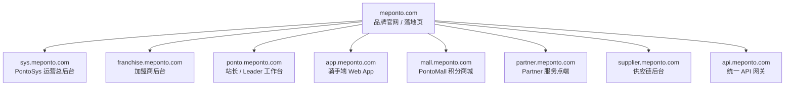

# MePonto 商业化域名部署 & 模块重构方案

## 背景

MePonto 当前是一个 **单体 Next.js 应用**，所有模块打包在 `meponto.vercel.app` 上。
代码中已在 [portals.ts](file:///Users/ishak/Documents/MePonto/app/lib/portals.ts) 规划了 7 个 Portal，
每个都有 `futureDomain` 字段。现在需要将其商业化部署到 `meponto.com`。

---

## 域名架构总览



---

## 8 个域名详细规划

### 1️⃣ `meponto.com` — 品牌官网（🆕 全新）

| 项目 | 说明 |
|------|------|
| **用途** | 品牌落地页、商业介绍、加盟招募入口、合作商入驻 |
| **目标用户** | 公众、潜在加盟商、投资人 |
| **当前状态** | ❌ 不存在。当前 `/` 直接跳转 `/login` |
| **需要的功能** | 品牌展示、价值主张、加盟申请表、联系方式、多语言（中/英/葡） |
| **技术方案** | 可独立静态站或集成到主应用 `app/page.tsx` |
| **优先级** | 🔴 **P0 — 商业化第一步** |

---

### 2️⃣ `sys.meponto.com` — PontoSys 运营总后台

| 项目 | 说明 |
|------|------|
| **用途** | 总部运营控制台：仪表盘、骑手管理、站点网络、财务结算、报表、权限、审计 |
| **目标用户** | 总部运营、区域经理、财务、客服 |
| **当前状态** | ✅ 功能最完整。44 个页面中约 25+ 属于此系统 |
| **包含模块** | `/dashboard`, `/riders`, `/pontos`, `/leaders`, `/incidents`, `/finance`, `/rewards`, `/reports`, `/analytics`, `/audit`, `/access-control`, `/security`, `/settings`, `/chat`, `/crm`, `/night-shift`, `/territory`, `/ninety-nine-import`, `/tools`, `/realtime`, `/slot-enrollment`, `/operations-core` |
| **需要整理** | 中间件路由按域名分流、去除 demo 数据依赖、完善 RBAC |
| **优先级** | 🟡 **P1 — 核心系统** |

---

### 3️⃣ `franchise.meponto.com` — 加盟商后台

| 项目 | 说明 |
|------|------|
| **用途** | 加盟商确认排班、查看下属站点、费用明细、合同管理 |
| **目标用户** | 加盟商负责人 |
| **当前状态** | ⚠️ 半成品。`/franchise` 页面有展示但功能不完整 |
| **包含模块** | `/franchise`, `/franchise-admin`, `/slot-enrollment`（加盟商视角）, `/finance/model` |
| **需要整理** | 独立登录流程、加盟商 RBAC 角色、排班确认工作流 |
| **优先级** | 🟡 **P1** |

---

### 4️⃣ `ponto.meponto.com` — 站长 / Leader 工作台

| 项目 | 说明 |
|------|------|
| **用途** | 站长排班初审、骑手管理、Chat 群管理、事件处理 |
| **目标用户** | Ponto 站长、Leader |
| **当前状态** | ⚠️ 分散在多个页面。`/leaders` 页面偏管理侧 |
| **包含模块** | `/leaders`（站长视角）, `/chat`, `/slot-enrollment`（初审）, `/incidents`（上报） |
| **需要整理** | 独立工作台 UI、站长专属仪表盘、简化导航 |
| **优先级** | 🟡 **P1** |

---

### 5️⃣ `app.meponto.com` — 骑手端 Web App

| 项目 | 说明 |
|------|------|
| **用途** | 骑手查看积分、排班报名、个人档案、通知、商城入口 |
| **目标用户** | 骑手（Rider） |
| **当前状态** | ⚠️ `/rider-app` 和 `/mobile` 页面存在但功能需要完善 |
| **包含模块** | `/rider-app`, `/mobile`, `/slot-enrollment`（骑手报名）, `/points-economy`（个人积分） |
| **需要整理** | 移动优先响应式设计、PWA 支持、离线缓存、推送通知 |
| **优先级** | 🔴 **P0 — 面向骑手的核心产品** |

---

### 6️⃣ `mall.meponto.com` — PontoMall 积分商城

| 项目 | 说明 |
|------|------|
| **用途** | 积分兑换商品/服务/优惠券、订单管理、履约跟踪 |
| **目标用户** | 骑手、Leader、Partner（所有生态参与者） |
| **当前状态** | ⚠️ `/marketplace` 和 `/pontomall` 页面存在，但偏管理后台 |
| **包含模块** | `/marketplace`, `/pontomall`, `/partner-points`（积分管理） |
| **需要整理** | 消费者友好的 UI、商品展示、购物车、积分支付、订单状态 |
| **优先级** | 🟠 **P2** |

---

### 7️⃣ `partner.meponto.com` — Partner 服务点端

| 项目 | 说明 |
|------|------|
| **用途** | 合作服务商（维修店、加油站、餐车等）核销服务、赚取积分 |
| **目标用户** | Partner 运营者 |
| **当前状态** | ⚠️ `/partner-app` 和 `/partner-points` 页面为骨架 |
| **包含模块** | `/partner-app`, `/partner-points`, `/marketplace`（Partner 消费） |
| **需要整理** | 服务核销流程、积分仪表盘、Partner 入驻流程 |
| **优先级** | 🟠 **P2** |

---

### 8️⃣ `supplier.meponto.com` — 供应链后台

| 项目 | 说明 |
|------|------|
| **用途** | 供应商查看商品状态、库存管理、站点履约订单 |
| **目标用户** | 供应商 |
| **当前状态** | ⚠️ `/supplier-admin` 页面为骨架 |
| **包含模块** | `/supplier-admin`, `/marketplace`（供应商视角） |
| **需要整理** | 供应商入驻、商品上架、库存同步、订单履约 |
| **优先级** | 🟢 **P3** |

---

### 9️⃣ `api.meponto.com` — 统一 API 网关（可选）

| 项目 | 说明 |
|------|------|
| **用途** | 所有系统共享的 REST/WebSocket API 入口 |
| **当前状态** | 内嵌在 Next.js `app/api/` 路由中 |
| **建议** | 初期继续使用 Next.js API Routes；后期独立部署到 api.meponto.com |
| **优先级** | 🟢 **P3** |

---

## 建议的实施顺序

> [!IMPORTANT]
> 推荐分 4 个阶段，每阶段 1-2 个域名，逐步商业化。

### 阶段一：商业化基础（P0）

```
meponto.com      → 品牌官网（对外第一印象）
app.meponto.com  → 骑手端（最大用户群）
```

### 阶段二：运营体系上线（P1）

```
sys.meponto.com       → 运营后台
franchise.meponto.com → 加盟商后台
ponto.meponto.com     → 站长工作台
```

### 阶段三：生态扩展（P2）

```
mall.meponto.com    → 积分商城
partner.meponto.com → Partner 服务点
```

### 阶段四：供应链完善（P3）

```
supplier.meponto.com → 供应链后台
api.meponto.com      → 独立 API 网关
```

---

## 技术实施方案

> [!NOTE]
> **两种路径可选，请告知偏好。**

### 方案 A：多站点单仓库（推荐初期）

- 保持 **一个 Next.js 项目**
- 使用 **Next.js Middleware** 根据 `request.headers.host` 分流到不同路由组
- 在 **Vercel** 上为每个子域名添加 custom domain，全部指向同一项目
- **优点**：代码共享、部署简单、改动小
- **缺点**：项目会越来越大

### 方案 B：Monorepo 多应用（推荐长期）

- 使用 **Turborepo / pnpm workspace**
- 共享包：`packages/ui`、`packages/supabase`、`packages/types`
- 独立应用：`apps/www`、`apps/sys`、`apps/rider`、`apps/mall` 等
- 每个应用独立部署到对应子域名
- **优点**：独立部署、独立扩展、清晰边界
- **缺点**：迁移工作量大

---

## 需要您决定的问题

> [!IMPORTANT]
> 1. **先做哪个域名？** 建议从 `meponto.com` 品牌官网开始，还是从 `app.meponto.com` 骑手端开始？
> 2. **技术路径**：选方案 A（中间件分流，快速上线）还是方案 B（Monorepo，长期架构）？
> 3. **DNS 配置**：`meponto.com` 的 DNS 是否在您手上？使用的是哪个 DNS 服务商（Cloudflare / Namecheap / Route53 等）？
> 4. **品牌官网风格**：是否有设计参考或竞品网站可以参考？
